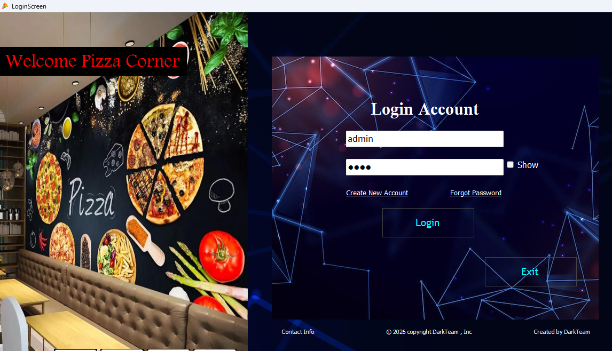
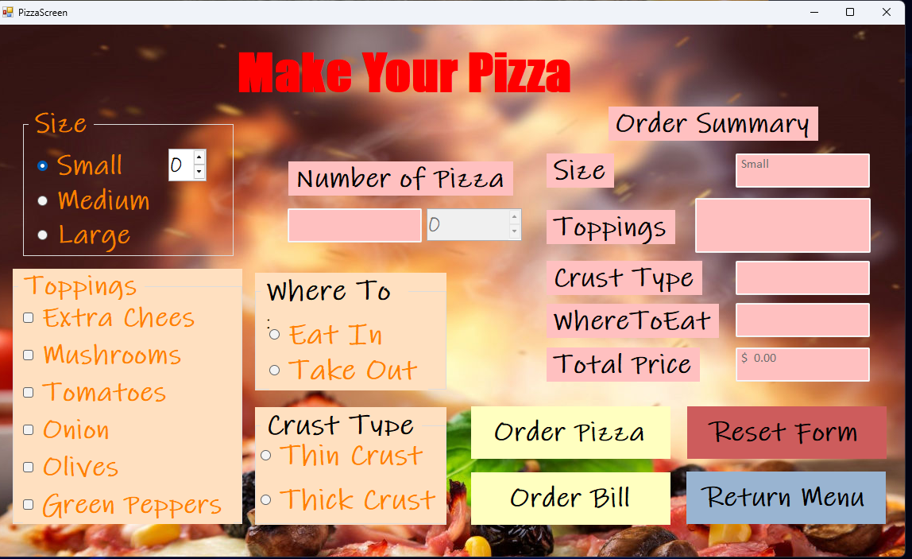

# 🍕 Project Pizza

---

## 📌 Overview
Project Pizza is a desktop application developed using **C# Windows Forms (.NET Framework)**.  
It simulates a pizza ordering system where users can register, log in, customize pizzas, and generate a detailed bill.

---

## 🎥 Demo Video
▶️ [Project Demo](https://youtu.be/ZSwYSMnNYpw)

---

## ✨ Main Features

### 🔐 1. User Authentication
- Login system with username and password
- Secure password storage using **SHA-256 hashing**
- Create new account feature
- Forgot password screen

---

### 🍕 2. Pizza Customization
Users can customize their pizza by selecting:
- **Size:** Small / Medium / Large  
- **Crust:** Thin / Thick  
- **Toppings:**
  - Extra Cheese
  - Mushrooms
  - Olives
  - Onion
  - Tomatoes
  - Green Peppers  

---

### 💰 3. Price Calculation
- Dynamic pricing based on:
  - Pizza size
  - Crust type
  - Selected toppings
  - Quantity
- Automatic total price update

---

### 🧾 4. Order Bill
Generates a complete bill including:
- Pizza size
- Crust type
- Toppings
- Eat in / Take out option
- Quantity
- Final price

---

### 🖥️ 5. User Interface
- Interactive Windows Forms UI
- Smooth navigation between screens
- Custom backgrounds and images
- User-friendly design

---

## 🛠️ Technologies Used
- C#
- Windows Forms (.NET Framework)
- Object-Oriented Programming (OOP)
- Event-Driven Programming
- SHA-256 Encryption
- Dictionaries & Enums

---

| Screen | Preview |
|--------|--------|
| Login  |  |
| Order  |  |

---

## 📚 Learning Outcomes
Through this project, I practiced:
- Windows Forms desktop development
- Object-Oriented Programming (OOP)
- Event-driven UI programming
- Authentication & password hashing
- Dynamic pricing logic using enums and dictionaries

---

## 👨‍💻 Author
- GitHub: [Project Repository](https://github.com/anasemadanas/PizzaProject)

---
